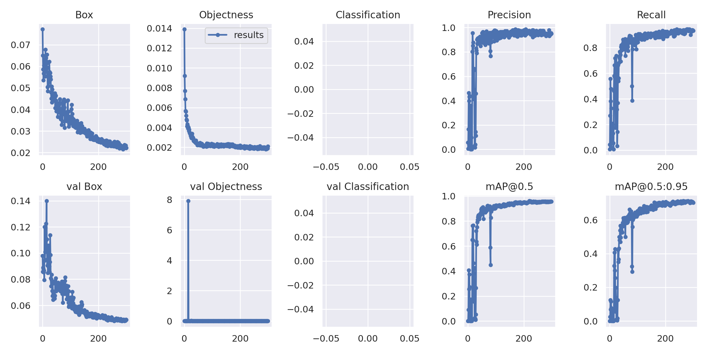
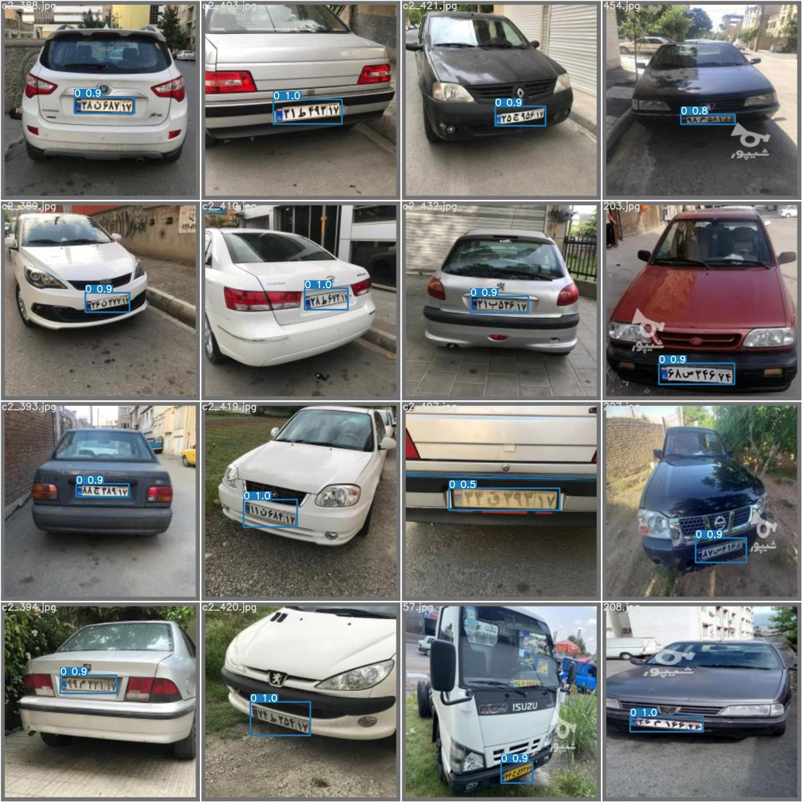
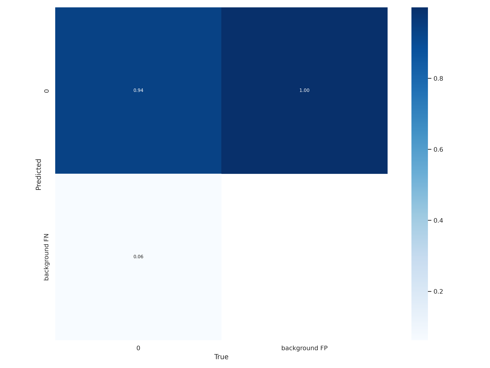
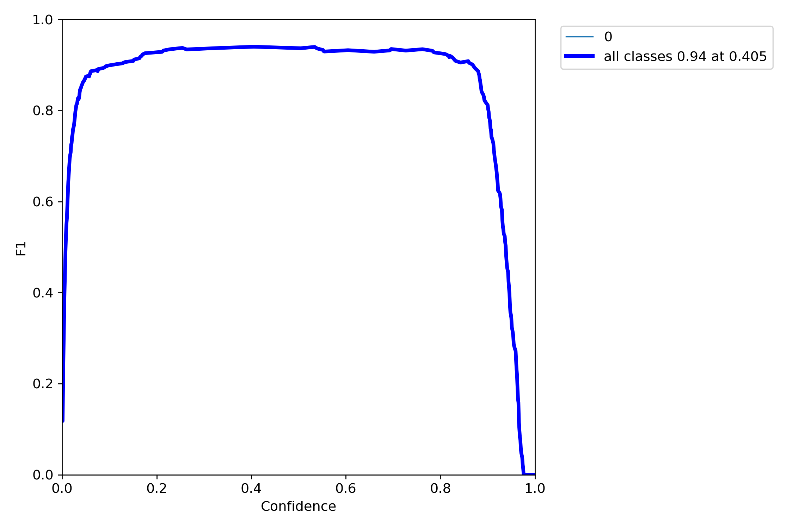
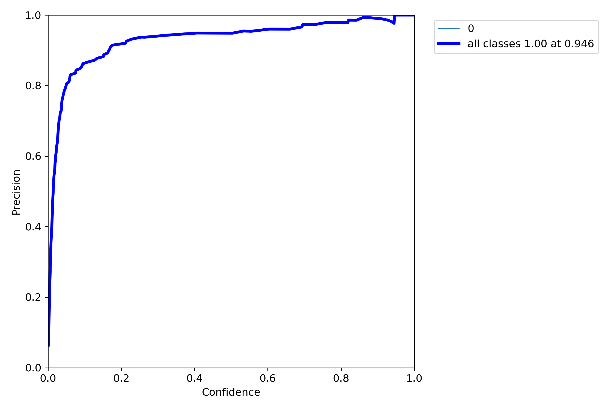
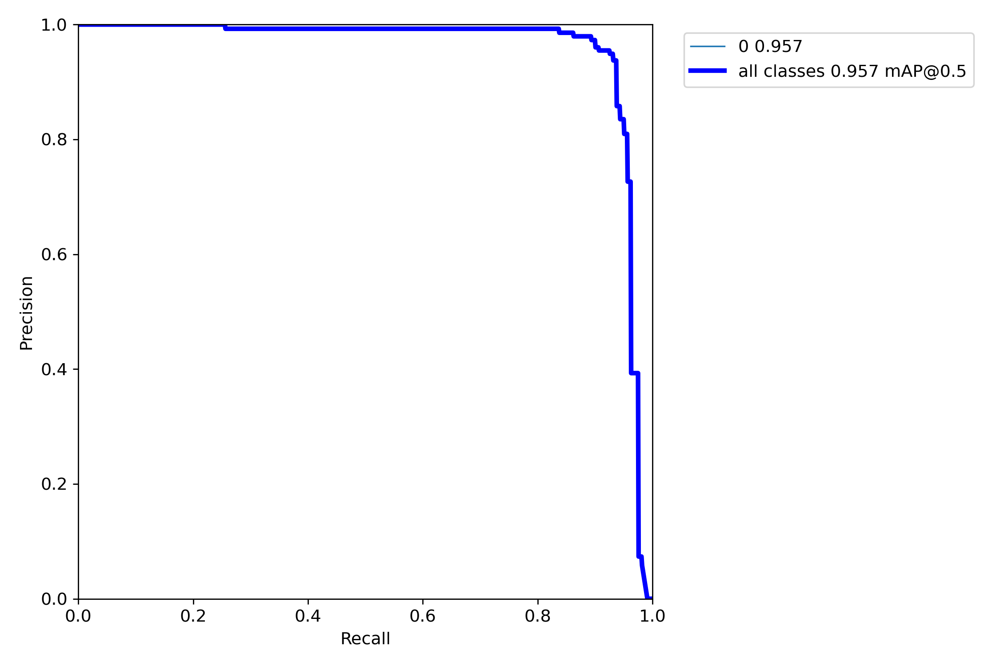
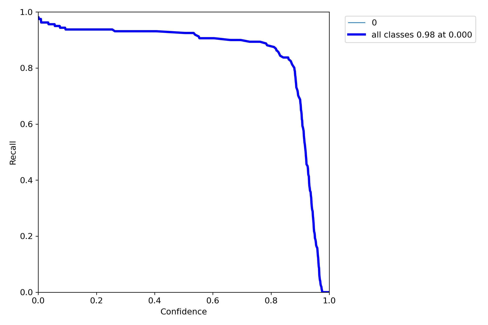

## Step 1: Collecting Dataset

Download Kaggle datasets in Google Colab
1. Once you need to download your Kaggle API key. To do this, go to your Kaggle account settings page, scroll down to the "API" section, and click on "Create New API Token". This will download a JSON file with your API key.
2. Open a new notebook in Google Colab and run the following code to upload your API key to the notebook
3. After uploading your API key, run the following commands to install the Kaggle library and create a directory to store the dataset:
```jupyter
!pip install -q kaggle
!mkdir -p ~/.kaggle
!cp kaggle.json ~/.kaggle/
```
4. Next, find the Kaggle dataset that you want to download and copy the API command that you can find in the "Download" section of the dataset page. The API command should look something like this:
```jupyter
!kaggle datasets download -d dataset_owner/dataset_name
```

For persian license palet we use these two datasets:
- https://www.kaggle.com/datasets/samyarr/iranvehicleplatedataset
- https://www.kaggle.com/datasets/skhalili/iraniancarnumberplate

5. To extract the files from the ZIP file, run the following command:
```jupyter
!unzip iraniancarnumberplate
!unzip iranvehicleplatedataset
```

## Step 2: Convert, Merge and Resize Datasets
1. First, we import the necessary libraries and modules:
- `os`: provides a way to interact with the operating system, such as creating directories and listing files in a directory
- `xml.etree.ElementTree`: provides a way to parse XML files
- `shutil.copyfile`: provides a way to copy files
- `PIL.Image`: provides a way to open and resize images

2. We define the input and output directories for our images and labels. You will need to replace the directory names in the code with the names of your own image and label directories.
3. We create the output directories if they don't already exist. The resized images will be saved to the output_folder/images directory, and the YOLO-style annotations will be saved to the output_folder/annotations directory.
4. We define a label mapping dictionary. This dictionary maps label names to integer IDs that will be used in the YOLO-style annotations. You will need to replace the label names in the code with the names of your own labels.
5. We define the target image size. In this example, we set the target size to 224x224 pixels.
6. We loop over all XML files in the label directory. For each XML file, we do the following:
    - Parse the XML file using `xml.etree.ElementTree`
    - Extract the image filename from the XML file
    - Open the corresponding image file using `PIL.Image`
    - Resize the image to the target size using the `resize` method from the `PIL.Image` library
    - Open an output file for the YOLO-style annotations
    - Loop over all objects in the XML file
      - Extract the object label
      - Map the label to an integer ID using the label mapping dictionary
      - Extract the object bounding box coordinates
      - Convert the bounding box coordinates to YOLO-style format (normalized coordinates)
      - Write the YOLO-style annotation to the output file
    - Close the output file for the YOLO-style annotations
    - Save the resized image to the output directory

The resulting files are organized in separate directories, making it easy to work with the data in the future.

After all, data seprate to train and validation to train with yolov7.

you can easily do all that works by run the following command: `python dataset.py`

## Training YOLOv7
For training yolov7 (Just Last layer (transfer learning)) run the following command : `python train_tf.py --device 0 --batch-size 32 --data data.yaml --img 640 640 --cfg cfg/training/yolov7.yaml --weights 'yolov7_training.pt' --hyp data/hyp.scratch.custom.yaml`


### Output Result
Here you can see output results of trained model

**Results:**


**Predicted Batch:**


**Confusion Matrix:**


**F1 Curve:**


**P Curve:**


**PR Curve:**


**R Curve:**


